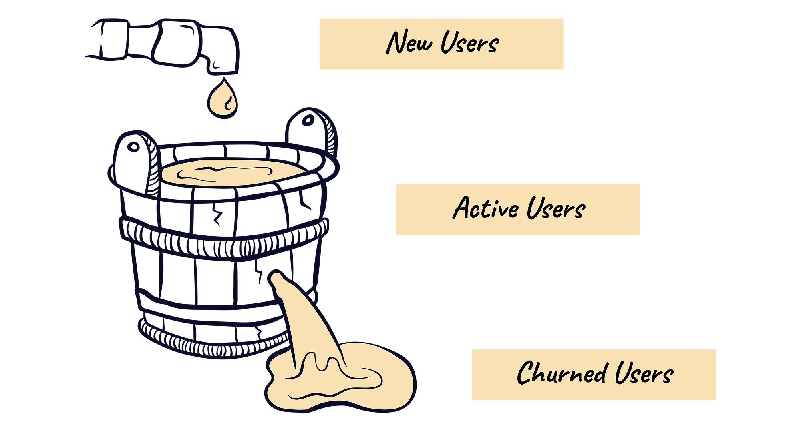

# 
Telecom Customer Churn Analysis

## Table of Contents
- [Project Background](#project-background)
- [Dataset Overview](#dataset-overview)
- [Data Understanding & Exploration](#data-understanding--exploration)
- [Data Cleaning & Preprocessing](#data-cleaning--preprocessing)
- [Feature Engineering](#feature-engineering)
- [Exploratory Data Analysis](#exploratory-data-analysis)
- [Hypothesis Testing](#hypothesis-testing)
- [Recommendations](#recommendations)

## Project Background

In today's digital economy, the subscription-based business model has become a dominant force across industries—from telecommunications to entertainment, fitness, and retail. This shift reflects a broader transition from transactional sales to recurring revenue, where long-term customer engagement and lifetime value are key drivers of profitability. Acquiring a new customer is usually much more expensive than retaining an existing one. Therefore, understanding why customers leave and which ones are most at risk allows organisations to design targeted retention campaigns and improve service quality.

The purpose of this churn‑analysis project is to:
- 🔍 **Explore** usage patterns, complaints and demographic factors to identify variables that differentiate churners from non‑churners.
- 💡 **Interpret feature importance** to discover which behaviours are most strongly associated with churn.
- 📈 **Translate findings into business recommendations**. For example, identifying high‑risk segments could help the telecom operator design retention campaigns, while recognising high‑value but at‑risk customers might prioritise personal outreach.

## Dataset Overview
The dataset has demographic and usage information from customers of a telecom company. The dataset was obtained from [the UCI Machine Learning Repository](https://archive.ics.uci.edu/dataset/563/iranian+churn+dataset).

## Data Understanding & Exploration

## Recommendations

