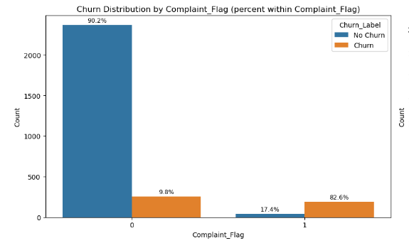

# 
Telecom Customer Churn Analysis

## Table of Contents
- [Project Background](#project-background)
- [Data Structure & Initial Checks](#data-structure--initial-checks)
- [Executive Summary](#executive-summary)
- [Exploratory Data Analysis](#exploratory-data-analysis)
- [Hypothesis Testing](#hypothesis-testing)
- [Recommendation](#recommendation)

## Project Background

In today's digital world, the subscription-based business model has become a dominant force across industries—from telecommunications to entertainment, fitness, and retail. This shift reflects a broader transition from transactional sales to recurring revenue, where long-term customer engagement and lifetime value are key drivers of profitability. It costs much more to win a new customer than it does to keep an existing one, so companies study why people cancel and focus on looking after those who might leave.

The purpose of this churn‑analysis project is to:
- 🔍 **Explore** usage patterns, complaints and demographic factors to identify variables that differentiate churners from non‑churners.
- 💡 **Interpret feature importance** to discover which behaviours are most strongly associated with churn.
- 📈 **Translate findings into business recommendations**. For example, identifying high‑risk segments could help the telecom operator design retention campaigns, while recognising high‑value but at‑risk customers might prioritise personal outreach.

### Libraries Used
numpy, pandas, matplotlib, seaborn

## Data Structure & Initial Checks
The dataset has demographic and usage information from customers of a telecom company. The dataset was obtained from [the UCI Machine Learning Repository](https://archive.ics.uci.edu/dataset/563/iranian+churn+dataset).

## Executive Summary
### Overview of findings
This analysis reveals key drivers of customer churn in a telecom dataset. Complaints emerged as the strongest churn trigger—customers who raised one were highly likely to leave. Nearly 99% of churned users were on pay-as-you-go plans, particularly those with low spending. Churn was most prevalent among younger customers (ages 20–40) during their first seven months of service. In contrast, long-tenured and higher-paying customers—especially those on contract plans—showed strong loyalty and low churn rates. Notably, network quality showed no meaningful correlation with churn behavior. These insights highlight strategic opportunities to improve retention and maximize customer lifetime value.

## Exploratory Data Analysis
### 1. Churn Distribution

> 15.6% of the customers left the business. 

### 2. Churn vs Complaint_Flag (Customer Usage Patterns)

> 82.6% of customers who raised a complaint subsequently left the business.

### 3. Churn vs Failure_Calls (Customer Usage Patterns)

> Failure calls do not show a big impact on churn.

### 4. Churn vs Age_Rank (Demographic)

> Churn is highest in Age Rank 3 (~20%), moderate in Age Ranks 1–2 (~16–17%), almost none in Age Rank 0, and very low in Age Rank 4 (~1%).

### 5. Churn vs Tenure_Group (Subscription)

> Churn risk is highest in the first 7 months (~50%), rises again after 2 years as customers explore alternatives, but drops to about 13% for those staying beyond 3 years. 

### 6. Churn vs Charge_Rank (Subscription)

> Low Charge_Rank (0) customers have the highest churn rate (~23.7%), meaning low-paying customers are much more likely to leave.
> Charge_Rank increases (1–4), the churn rate drops sharply (from ~7.5% to ~1.4%).
> Charge_Rank 5 and above, churn is almost zero, showing that high-paying customers are highly loyal.

### 7. Churn vs Tariff_Plan (Subscription)

> An overwhelming 98.7% of churned users are on pay-as-you-go plans, signaling a critical retention gap in the non-contract segment.

## 8. Churn Pearson Correlation Test

> Churn is most strongly linked to complaints

## Hypothesis Testing
### Customer LTV vs Tenure Group (One way ANOVA & Tukey's HSD)

> Longer retention drives higher lifetime value, making customer loyalty a direct path to profitability.

### Charge_Rank vs Tariff_Plan (Chi-squre Test)

> High-charge customers are far more likely to be on contractual plans, while low-charge users (0,1,2,7) mostly choose pay-as-you-go.

## Recommendations
- **Fix complaints system** → Review and reform to be a proactive resolution system. Log complaint reasons and implement corrective actions to prevent recurrence. Flag early-tenure users in the CRM for extra care and timely follow-up.
- **Focus retention efforts in at-risk segments** → Strengthen the onboarding journey to drive higher engagement during the first 7 months—a critical window for churn prevention.
- **Grow loyalty & lifetime value** → Encourage migration from pay-as-you-go to contract plans, and reward high-value, long-term customers to reinforce loyalty and increase profitability
- **Increase revenue** → Tenure Group 2 represents a high-value segment—our cash cow. Prioritize upsell and cross-sell strategies to unlock additional growth and maximize customer lifetime value.

